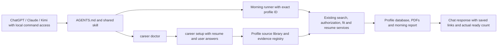

# Developer guide

How the workspace fits together, where to change things, and how to prove a change is safe to
publish. Users start at [START-HERE.md](../START-HERE.md); setup is in [README.md](../README.md).

## Layout

```text
AGENTS.md, CLAUDE.md        instructions every AI app reads first (CLAUDE.md imports AGENTS.md)
START-HERE.md               the non-technical guide
.agents/skills/<name>/      the shared skills: SKILL.md (+ references/, agents/openai.yaml for Codex)
.claude/skills/<name>/      pointers so Claude Code lists the same skills; never add rules here
me/, my-jobs/               a person's inbox and the AI-only lists (private; only READMEs ship)
career, career.cmd          the CLI for AI apps (macOS/Linux/Git Bash, Windows)
Start Dashboard.*           launcher: scripts/bootstrap.py installs, checks tools, runs the app
Check Workspace.*           the full release gate
scripts/                    bootstrap, career_doctor, reset_template, scan_release, smoke_first_run
daily-job-search/           autopilot.py: the morning runner (morning-jobs.cmd/.command), AUTOPILOT.md
career-dashboard/
  backend/                  FastAPI app, services, AI routing, country packs, CLI scripts
  frontend/                 React + Vite client (eight tabs)
  tests/portable/           the test suite (disposable profiles only)
  profiles/<id>/            private profiles (ignored): sources, SQLite database, outputs
backup/                     local backups (ignored, never read by AI apps)
```

## The two modes of the AI-app layer

`AGENTS.md` routes each request to a skill and picks a mode once per conversation:

- **App mode**: the AI app can run commands here and `career doctor` returns `app_mode: true`.
  Zero profiles is a normal installed state and routes to `career setup`. Skills
  call the CLI and the morning runner; the app's gates, evidence registry and validators do the
  work.
- **AI-only mode**: anything else (for example Cowork's cloud sandbox, which cannot run the
  installed app). Skills tell the AI to do the same steps by hand from `me/` and write to
  `my-jobs/` (`tracker.csv`, dated `JOBS.md`, one folder per job).

Both modes follow the same evidence rules, but only App mode shares the app's database and
validators. AI-only files are not automatically synced. When you change app behaviour that a skill describes (a command, a gate, a file
path), update the skill in the same change. Codex and Kimi Code discover `.agents/skills/`;
Claude Code discovers `.claude/skills/`, whose pointer files must keep the same `name` and
`description` as the shared skill (a test checks this).

## Backend (`career-dashboard/backend`)

| Area | Where |
|---|---|
| Profiles and the registry (`profiles/registry.json`) | `profiles.py` (`ProfileStore`), `paths.py` |
| App shell: profile routes, onboarding, loopback guard | `dashboard/shell.py`, `dashboard/app.py` |
| Per-profile API (`/p/<id>/api/v2/...`) | `dashboard/api_v2.py` |
| Application services (jobs, goals, profile, cover letters) | `services/workspace_v2.py` (`CareerServices`) |
| Onboarding: sources, build runs, extraction | `services/source_library.py`, `services/intake/` |
| Job discovery: feeds without AI, the overnight hunt | `services/job_sources.py`, `services/hunt.py`, `services/search_plan.py`, `services/search_memory.py` |
| Gates: market, work permit, never re-apply, fit | `services/sponsorship.py`, `countries/<ie\|us>/`, `services/reapply.py`, `services/fit.py`, `job_quality.py`, `role_titles.py` |
| Agents and runs (research, tailoring, study plan) | `services/agents.py` (`AgentRunner`), `services/pipeline.py` |
| Ready-to-submit check (verdict and readiness score) | `services/readiness.py`, `GET /studio/<job>/readiness` |
| Resume Studio, page contract, PDF | `services/resume_studio.py`, `resume_contract.py`, `pdf_compiler.py` (Tectonic), `ai_marks.py` |
| Assistant (one chat, every feature as a tool) | `services/assistant.py`, `services/assistant_tools.py` (`Toolbox`) |
| AI providers and routing (Kimi Code, Codex, Claude Code, keyed APIs) | `ai/router.py`, `ai/providers.py`, `ai/agents/` |
| Morning task (Windows Task Scheduler) | `services/schedule_tasks.py` |

SQLite in each profile owns mutable state; source documents and the evidence registry
(`data/context/evidence.yml`) are the only candidate evidence. The hiring-manager review and
company research never see the profile.

## The `career` CLI

`career.cmd` (Windows) or `sh career` runs `backend/scripts/career_cli.py` with the app's Python.
Every command works on the last opened profile unless given `--profile <id>`, prints JSON and
needs no running server.

AI hosts must pass the selected profile ID explicitly; the last-used profile is a UI convenience,
not proof of the current person's identity. `doctor` lists registry IDs/states without reading
candidate documents. It works using the standard library before dependencies or profiles exist,
and distinguishes missing dependencies, empty onboarding, multiple profiles and invalid selection.
Installed provider executables are reported as available, never as authenticated.

| Command | Does |
|---|---|
| `career doctor [--profile <id>]` | read-only readiness and concrete next actions, including zero-profile setup |
| `career setup --name "…" --market ie\|us\|both --work-auth '<json>'` | create a profile from the files in `me/` and run the build (`--profile <id>` rebuilds) |
| `career status`, `career jobs`, `career activity` | profile summary, saved jobs, event log |
| `career add --file job.json` | save a posting through the sponsorship and never-re-apply gates |
| `career update <id> --status … [--application-date]` | record an application outcome |
| `career prepare <id>`, `preview <id>`, `validate <id>` | application folder, compile, QA |
| `career ws fit --job-id <id> [--refresh]` | requirement matrix and fit score |
| `career ws tailor --job-id <id>` | Resume Studio tailoring (AI when ready) and the fitted PDF |
| `career ws run --kind research\|resume_match\|study_plan\|discovery … --job-id <id>` | one agent run |
| `career ws sponsor-check`, `check-reapply`, `ai-status` | gates and AI readiness |
| `career verify-url --url …`, `career check-resume …`, `career check` | link check, resume validator, workspace validator |

A Daily Search run (and the hunt's preparing phase) takes each job end to end, one helper after the
other, in `pipeline.STEPS` order: `posting` (re-read; a closed posting stops the job before it gets a
folder), `research` (company research, hiring-manager view, profile fit), `tailor`, `pdf`, `review`
(a `resume_match` run on the current PDF), `study_plan` and `ready` (`services/readiness.py`). All are
on by default. A search that comes back short runs up to `MAX_FIND_PASSES` focused web passes
(`search_plan.strategies`), each skipping the URLs earlier passes looked at; the no-AI sources make one
pass. The chat's "find jobs" / "give me N jobs" shortcut starts the same pipeline.

Independent PDF review results retain their exact PDF/JD hashes and include `review.verdict`
(`pass`, `review`, `blocked`) and `review.issues`. Readiness requires `pass` with no unresolved
issues; a completed run or an older report without a verdict is not a passed check.

The morning runner: `daily-job-search/morning-jobs.cmd` (`.command`) with `--jobs N` (find N now),
`--list-only`, `--background`, `--check`, `--hours`, `--profile`. See
[AUTOPILOT.md](../daily-job-search/AUTOPILOT.md).

## The chat-to-app path



The Python API, CLI and built-in Assistant use the same services. The external AI host supplies
the conversation and optional connectors; it must read command results before reporting success.
Gmail/Drive sign-in in a host is not a backend mail connection. Download requested input files
to `me/` before importing; keep generated local artifacts even when a user requests a cloud copy.
Host schedules use the original checkout (ignored profiles do not appear in new worktrees).
The Windows morning task prepares files; a separate host task displays them in chat.

## Reusing a populated development copy

Use [the reset procedure](RESET-TEMPLATE.md) to preview and explicitly delete active private data.
It preserves code, guides, installed dependencies and `backup/`, refuses paths outside the
workspace and does not read candidate contents. It cannot clean Git history or external storage.
Do not remove source modules just because they look old: compatibility routes and migrations
still have callers. Remove generated/private outputs through the reset tool, and keep portable
regression tests and release checks in the template.

## Tests and the release gate

```text
Check Workspace.cmd                       Windows: everything below, in order
bash "Check Workspace.command"            macOS
```

1. Launcher preflight (dependencies, tools), then `pip install -r backend/requirements-dev.txt`.
2. `python -m pytest -q` in `career-dashboard/` (`pytest.ini` selects `tests/portable`).
3. `scripts/check_profiles.py` (local profiles' database and PDFs; passes with none) and
   `backend/scripts/validate_workspace.py`.
4. `npm test` and `npm run build` in `career-dashboard/frontend/`.
5. `scripts/scan_release.py`: fails when a file Git would publish holds a private path, a person's
   name or resume detail, a phone number, an email outside example domains, a home path or a
   credential, or when a required `.gitignore` rule is missing.
6. `scripts/smoke_first_run.py`: a zero-profile start, onboarding and profile isolation.

Tests use disposable profiles (`ProfileStore(base=tmp_path/...)`); `tests/portable/conftest.py`
keeps AI apps, job boards and the Task Scheduler offline. Never point a test, a screenshot or a
fixture at a real profile. GitHub Actions (`.github/workflows/check.yml`) runs the privacy scan
first, then the same gate on Windows and macOS.

## Publishing

Only generic code, public country data and the guides are published. Before a commit, run
`python scripts/scan_release.py`. A fresh clone must start with no profile, database, outputs,
credentials or application history.
