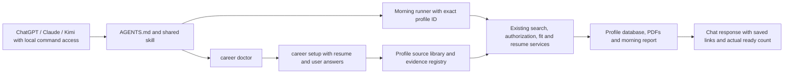

# Developer guide

How the workspace fits together, where to change things, and how to prove a change is safe to
publish. Users start at [START-HERE.md](../START-HERE.md); setup is in [README.md](../README.md).

## Layout

```text
AGENTS.md, CLAUDE.md        instructions every AI app reads first (CLAUDE.md imports AGENTS.md)
START-HERE.md               the non-technical guide
.agents/skills/<name>/      the shared skills: SKILL.md (+ references/, agents/openai.yaml for Codex)
.claude/skills/<name>/      pointers so Claude Code lists the same skills; never add rules here
me/, my-jobs/               a person's inbox and the AI-only lists (private; only READMEs ship)
career, career.cmd          the CLI for AI apps (macOS/Linux/Git Bash, Windows)
Start Dashboard.*           launcher: scripts/bootstrap.py installs, checks tools, runs the app
Check Workspace.*           the full release gate
scripts/                    bootstrap, career_doctor, reset_template, scan_release, smoke_first_run
daily-job-search/           autopilot.py: the morning runner (morning-jobs.cmd/.command), AUTOPILOT.md
career-dashboard/
  backend/                  FastAPI app, services, AI routing, country packs, CLI scripts
  frontend/                 React + Vite client (eight tabs)
  tests/portable/           the test suite (disposable profiles only)
  profiles/<id>/            private profiles (ignored): sources, SQLite database, outputs
backup/                     local backups (ignored, never read by AI apps)
```

## The two modes of the AI-app layer

`AGENTS.md` routes each request to a skill and picks a mode once per conversation:

- **App mode**: the AI app can run commands here and `career doctor` returns `app_mode: true`.
  Zero profiles is a normal installed state and routes to `career setup`. Skills
  call the CLI and the morning runner; the app's gates, evidence registry and validators do the
  work.
- **AI-only mode**: anything else (for example Cowork's cloud sandbox, which cannot run the
  installed app). Skills tell the AI to do the same steps by hand from `me/` and write to
  `my-jobs/` (`tracker.csv`, dated `JOBS.md`, one folder per job).

Both modes follow the same evidence rules, but only App mode shares the app's database and
validators. AI-only files are not automatically synced. When you change app behaviour that a skill describes (a command, a gate, a file
path), update the skill in the same change. Codex and Kimi Code discover `.agents/skills/`;
Claude Code discovers `.claude/skills/`, whose pointer files must keep the same `name` and
`description` as the shared skill (a test checks this).

## Backend (`career-dashboard/backend`)

| Area | Where |
|---|---|
| Profiles and the registry (`profiles/registry.json`) | `profiles.py` (`ProfileStore`), `paths.py` |
| App shell: profile routes, onboarding, loopback guard | `dashboard/shell.py`, `dashboard/app.py` |
| Per-profile API (`/p/<id>/api/v2/...`) | `dashboard/api_v2.py` |
| Application services (jobs, goals, profile, cover letters) | `services/workspace_v2.py` (`CareerServices`) |
| Onboarding: sources, build runs, extraction | `services/source_library.py`, `services/intake/` |
| Job discovery: feeds without AI, the overnight hunt | `services/job_sources.py`, `services/hunt.py`, `services/search_plan.py`, `services/search_memory.py` |
| Gates: market, work permit, never re-apply, fit | `services/sponsorship.py`, `countries/<ie\|us>/`, `services/reapply.py`, `services/fit.py`, `job_quality.py`, `role_titles.py` |
| Agents and runs (research, tailoring, study plan) | `services/agents.py` (`AgentRunner`), `services/pipeline.py` |
| Ready-to-submit check (verdict and readiness score) | `services/readiness.py`, `GET /studio/<job>/readiness` |
| What only the person can do now (Dashboard and morning list) | `services/needs_you.py`, `summary.needs_you` |
| Resume Studio, page contract, PDF | `services/resume_studio.py`, `resume_contract.py`, `pdf_compiler.py` (Tectonic), `ai_marks.py` |
| Assistant (one chat, every feature as a tool) | `services/assistant.py`, `services/assistant_tools.py` (`Toolbox`) |
| AI providers and routing (Kimi Code, Codex, Claude Code, keyed APIs) | `ai/router.py`, `ai/providers.py`, `ai/agents/` |
| Morning task (Windows Task Scheduler) | `services/schedule_tasks.py` |
| Tracing (agent runs, AI calls, web requests; local SQLite, optional OTLP) | `telemetry/`, `GET /agents/runs/<id>/spans`, `career trace` ([OBSERVABILITY.md](OBSERVABILITY.md)) |
| Irish employment-permit rules (dated, with review date) | `countries/ie/permit-rules.yml`, `services/permit_assessment.py` (`freshness`) |

SQLite in each profile owns mutable state; source documents and the evidence registry
(`data/context/evidence.yml`) are the only candidate evidence. The hiring-manager review and
company research never see the profile.

### Markets: Ireland only, US dormant

`countries/markets.yml` (`enabled: [ie]`) is the one switch for the markets this copy offers.
Onboarding, `career setup --market`, the profile list and every search and preparation
(`require_known_authorization`) refuse a switched-off market; `countries.available()` lists only
enabled packs, `available(include_disabled=True)` every pack. The US pack, its USCIS data and its
code paths stay in place and are tested: tests that need them request the `us_enabled` fixture
(`CAREER_MARKETS=ie,us`). A profile built for a switched-off market keeps its own rules and is
refused with a message; it is never moved to another country.
Rebuilding a profile whose only market is disabled is blocked in both the source library
and intake services. A failed rebuild restores its original registry market selection,
including dormant markets, as well as its files and job database.

**Re-enabling a market** (for example the US):

1. Add its code to `enabled:` in `countries/markets.yml`.
2. Copy `countries/us/agent-skill/us-job-sources/` to `.agents/skills/us-job-sources/` and
   `countries/us/agent-skill/claude-pointer/SKILL.md` to `.claude/skills/us-job-sources/SKILL.md`.
3. Restore the AGENTS.md routing row, the `find-jobs` source list and the US column of the
   `tailor-resume` format reference (kept in `countries/us/agent-skill/resume-format-us.md`).
4. Run the release gate: `validate_workspace.py` fails while the skill folders and the enabled
   markets disagree.

## The `career` CLI

`career.cmd` (Windows) or `sh career` runs `backend/scripts/career_cli.py` with the app's Python.
Every command works on the last opened profile unless given `--profile <id>`, prints JSON and
needs no running server.

AI hosts must pass the selected profile ID explicitly; the last-used profile is a UI convenience,
not proof of the current person's identity. `doctor` lists registry IDs/states without reading
candidate documents. It works using the standard library before dependencies or profiles exist,
and distinguishes missing dependencies, empty onboarding, multiple profiles and invalid selection.
Installed provider executables are reported as available, never as authenticated.

| Command | Does |
|---|---|
| `career doctor [--profile <id>]` | read-only readiness and concrete next actions, including zero-profile setup |
| `career setup --name "…" --market ie --work-auth '<json>'` | create a profile from the files in `me/` and run the build (`--profile <id>` rebuilds) |
| `career status`, `career jobs`, `career activity` | profile summary, saved jobs, event log |
| `career add --file job.json` | save a posting through the sponsorship and never-re-apply gates |
| `career update <id> --status … [--application-date]` | record an application outcome |
| `career prepare <id>`, `preview <id>`, `validate <id>` | application folder, compile, QA |
| `career ws fit --job-id <id> [--refresh]` | requirement matrix and fit score |
| `career ws tailor --job-id <id>` | Resume Studio tailoring (AI when ready) and the fitted PDF |
| `career ws run --kind research\|resume_match\|study_plan\|discovery … --job-id <id>` | one agent run |
| `career ws sponsor-check`, `check-reapply`, `ai-status` | gates and AI readiness |
| `career trace list`, `career trace show <run-id>` | agent run timelines from the profile's local trace file |
| `career verify-url --url …`, `career check-resume …`, `career check` | link check, resume validator, workspace validator |

A Daily Search run (and the hunt's preparing phase) takes each job end to end, one helper after the
other, in `pipeline.STEPS` order: `posting` (re-read; a closed posting stops the job before it gets a
folder), `research` (company research, hiring-manager view, profile fit), `tailor`, `pdf`, `review`
(a `resume_match` run on the current PDF), `study_plan` and `ready` (`services/readiness.py`). All are
on by default. A search that comes back short runs up to `MAX_FIND_PASSES` focused web passes
(`search_plan.strategies`), each skipping the URLs earlier passes looked at; the no-AI sources make one
pass. The chat's "find jobs" / "give me N jobs" shortcut starts the same pipeline.

Independent PDF review results retain their exact PDF/JD hashes and include `review.verdict`
(`pass`, `review`, `blocked`) and `review.issues`. Readiness requires `pass` with no unresolved
issues; a completed run or an older report without a verdict is not a passed check.

The morning runner: `daily-job-search/morning-jobs.cmd` (`.command`) with `--jobs N` (find N now),
`--list-only`, `--background`, `--check`, `--hours`, `--profile`. See
[AUTOPILOT.md](../daily-job-search/AUTOPILOT.md).

## The chat-to-app path



The Python API, CLI and built-in Assistant use the same services. The external AI host supplies
the conversation and optional connectors; it must read command results before reporting success.
Gmail/Drive sign-in in a host is not a backend mail connection. Download requested input files
to `me/` before importing; keep generated local artifacts even when a user requests a cloud copy.
Host schedules use the original checkout (ignored profiles do not appear in new worktrees).
The Windows morning task prepares files; a separate host task displays them in chat.

## Reusing a populated development copy

Use [the reset procedure](RESET-TEMPLATE.md) to preview and explicitly delete active private data.
It preserves code, guides, installed dependencies and `backup/`, refuses paths outside the
workspace and does not read candidate contents. It cannot clean Git history or external storage.
Do not remove source modules just because they look old: compatibility routes and migrations
still have callers. Remove generated/private outputs through the reset tool, and keep portable
regression tests and release checks in the template.

## Tests and the release gate

### Staged Ireland engine

The Ireland engine is being implemented in milestones. M1 provides the market
switch, dated permit metadata with freshness warnings, removed restricted feed,
local tracing, rollout switches and a synthetic demo builder. M2 adds the Irish
data foundation in `backend/permits/`: DETE permit history (tier B ranking, never
exclusion), the Critical Skills and Ineligible occupation lists, person-confirmed
permit facts (permission type, exact expiry, award date, NFQ level) and a dated
permit assessment with a personal salary floor. Their sources and refresh
commands are in `docs/DATA-SOURCES.md`. M3 adds the discovery core: the shared
public market store (`backend/market/`), the EURES / JobsIreland reader, a
politer fetcher (Crawl-delay, Retry-After, backoff, a circuit breaker, ETag
re-reads, gzip; a page over 3 MB, or a documented job API over 25 MB, is that
page's error and never trips the breaker), structured ATS pay, market salary estimates, the
salary policies (`include_unstated`, the default, also prepares postings that state no pay and
flags them; `confirmed_or_estimated`; `confirmed_only`), and the permit-path evidence score
(`backend/permits/path_score.py`). HTTPS is verified with the operating system's
trust store (`truststore`, injected in `backend/__init__.py`). M4 adds the
employer registry of DETE permit employers' careers boards
(`backend/market/resolver.py`, `registry.py`, `scripts/build_employer_registry.py`),
readers for Workable, Recruitee, Personio, Teamtailor and Lever's EU data centre
(`backend/market/readers/ats.py`), the optional Careerjet and Jooble lead sources
(`backend/market/readers/aggregators.py`) under one source policy
(`backend/market/policy.py`), the pasted-link resolver
(`backend/services/lead_resolver.py`, used by `career add --url` and the
Assistant) and the Tracker (`backend/market/tracker.py`, the Tracker tab).

M5 and M6 add durable LangGraph workflows in `backend/graphs/` (LangGraph 1.2;
`runtime.py` is the context every node gets, `checkpoint.py` the per-profile
`data/agents.db` with strict deserialisation and 30-day pruning, `executor.py` runs or
resumes a thread `<graph>:<run id>`, `policies.py` retries transient network errors
only, `history.py` reads a thread checkpoint by checkpoint for the viewer):

- `dossier.py` (CompanyDossierGraph): deterministic DETE/registry/EURES facts, then one
  web-researching AI call per facet in parallel (`Send`), and a claim is kept only when
  its quote is on the cited public page word for word (news within 12 months). Shared by
  every profile through the market store for 30 days.
- `research.py` (ResearchGraph, `graph_research`): the dossier, then the hiring
  manager's view (posting and public research only) in parallel with the requirement
  check, then the profile comparison; writes `company-research.md`,
  `hiring-manager.md` and `role-analysis.json`, which the tailor reads as ranking
  guidance.
- `job_prep.py` (JobPrepGraph v1, `graph_pipeline`): each Daily Search helper is a node
  running `Pipeline._job_step`, the classic loop's own code, checkpointed per helper;
  `tests/portable/test_job_prep_graph.py` runs both paths and compares them.
- `tracker_refresh.py` (TrackerRefresh, `graph_tracker_refresh`, functional API): the
  public sources re-read for the ready profiles' roles every 6 hours, once per computer
  (`MarketStore.claim_run`), into the market store only; `career market refresh` runs it
  by hand.

Documents: `services/docx_export.py` makes the Word CV from the same checked LaTeX
revision as the PDF and the Word cover letter; `services/cover_letters.py` drafts
letters with the `cover_letter_writer` specialist from registered evidence and verified
dossier claims, checks every number, name and skill, and has the `letter_auditor`
specialist (a second AI that did not write the draft) list any sentence about the person
the evidence does not state; a draft that fails twice, or whose audit cannot run, gives a
template from registered sentences. The Daily Search helper `cover_letter` (off by
default; `pipeline.ON_DEMAND`) runs it per job. `services/rewrite_guard.py` admits a
reworded project bullet only when it states the same facts (switch: `evidence_rewrites`),
and `validate_resume.py` re-runs it on the saved source. AI calls queue one per AI app;
a queued call waits up to `CAREER_AI_SLOT_TIMEOUT` seconds (default 960, longer than one
web call) and graph fan-out is capped at two branches (`graphs/executor.MAX_CONCURRENCY`).
The overnight hunt researches comparable pay for jobs that state none (free AI plans only,
`hunt.PAY_RESEARCH_PER_DAY` a day); under the default salary policy researched pay at or
above the floor prepares the job with a note to confirm the salary with the recruiter.
The overnight hunt keeps its own loop (`services/hunt.py`, which already resumes after a
restart). LangGraph Studio runs the research and dossier graphs on the synthetic demo profile
(`langgraph.json`, `backend/graphs/studio.py`; see `docs/OBSERVABILITY.md`), and a research
run can be run again from any checkpoint (`career trace rerun`, or the Checkpoints tab).

`backend/features.py` defines opt-in switches. The profile preference `features`
accepts booleans by registered name; `CAREER_FEATURES=tracker,-graph_pipeline`
overrides them for a process. Finished parts default to on, so their switch is an
off switch (`market_store`, `tracker`, `docx_export`, `evidence_rewrites`, and the two graphs
that passed live runs on 2026-10-04: `graph_research` on Kimi Code and `graph_tracker_refresh`,
which needs no AI); `graph_pipeline` stays off until it has run on friends' computers. The
overnight hunt has no graph switch: it keeps its own resumable loop.

Build the synthetic Irish graduate with the backend Python:

```text
python career-dashboard/backend/scripts/make_demo_profile.py --as-of 2026-10-03
```

It writes to ignored `career-dashboard/data/demo/profiles`, with its own registry
and a synthetic marker. It refuses existing profile data and the users' registry.
It uses the normal deterministic evidence and resume builder, does not weaken
the evidence gates, and does not call AI or compile a PDF. Pass its separate
registry to smoke tools; demo/Studio tools must call `require_synthetic_demo`
before opening a workspace. Real profiles stay outside these tests.

The rules must be reverified before January 2027: the official remuneration
roadmap schedules another change then, so the 2026 figures expire after
2026-12-31, earlier than the original proposed February review date.

```text
Check Workspace.cmd                       Windows: everything below, in order
bash "Check Workspace.command"            macOS
```

1. Launcher preflight (dependencies, tools), then `pip install -r backend/requirements-dev.txt`.
2. `python -m pytest -q` in `career-dashboard/` (`pytest.ini` selects `tests/portable`).
3. `scripts/check_profiles.py` (local profiles' database and PDFs; passes with none) and
   `backend/scripts/validate_workspace.py`.
4. `npm test` and `npm run build` in `career-dashboard/frontend/`.
5. `scripts/scan_release.py`: fails when a file Git would publish holds a private path, a person's
   name or resume detail, a phone number, an email outside example domains, a home path or a
   credential, or when a required `.gitignore` rule is missing.
6. `scripts/smoke_first_run.py`: a zero-profile start, onboarding and profile isolation.

Tests use disposable profiles (`ProfileStore(base=tmp_path/...)`); `tests/portable/conftest.py`
keeps AI apps, job boards and the Task Scheduler offline. Never point a test, a screenshot or a
fixture at a real profile. There is no hosted CI: run this check yourself before every commit
or push.

## Publishing

Only generic code, public country data and the guides are published. Before a commit, run
`python scripts/scan_release.py`. A fresh clone must start with no profile, database, outputs,
credentials or application history.

Before sharing a branch, `python scripts/fresh_clone_check.py --branch template-clean` clones the
committed branch into a temporary folder and checks that every data file, launcher and skill the
app needs is there and nothing private is; `--full` also installs it into a fresh environment and
runs the tests. Hosting the app for many people is a separate design: `docs/HOSTING.md`.
